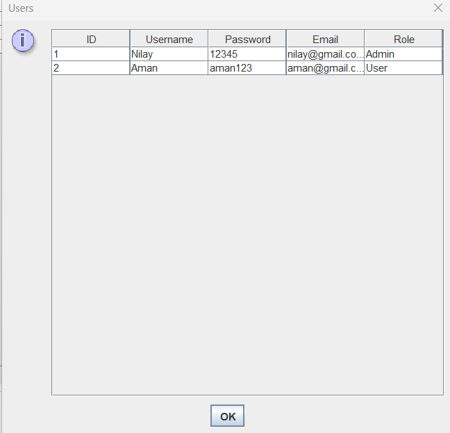

# Inventory-Management-System

## Description
- A simple inventory management system using:
  - **Java** (Swing for GUI)
  - **Hibernate**
  - **MySQL**

## Features
- **User Login/Registration**:
  - Users and Admins can create accounts and log in.
  
- **Admin Features**:
  - **Manage products**:
    - Insert
    - Update
    - Delete
    - Set categories and prices
  - View all users
  - Manage product categories
  - View all placed orders

- **User Features**:
  - Browse products by category
  - Add products to the cart with specified quantities
  - Place orders
  - View and update cart contents

## GUI
- Separate interfaces for Admin and User:
  - Professional, user-friendly design
  - Dropdown for categories
  - Adjustable product views

## Login Interface
  
## Admin Interface  
  
## User Interface
  
## Product Cataloge 
  
## Cart View  
  

## Technologies Used
- **Java**
- **Swing** (for GUI)
- **Hibernate** (for database interaction)
- **MySQL**
- **Maven**

## Database Schema
- **users**:
  - Stores user details: `id`, `username`, `password`, `email`, `role`
  
- **products**:
  - Stores product info: `product_id`, `product_name`, `price`, `quantity`, `category`
  
- **orders**:
  - Stores order details: `user_id`, `product_id`, `quantity`, `order_date`

## How to Use
- **Login as Admin**:
  - Manage products, view users, oversee orders

- **Login as User**:
  - Browse products, manage cart, place orders

## Author
#### Nilay Waghmare
#### Aman Sahare
#### Sanket Appa
#### Shivkrishna Rangu
#### Aman Mourya
#### Vrushali Rahangdale

